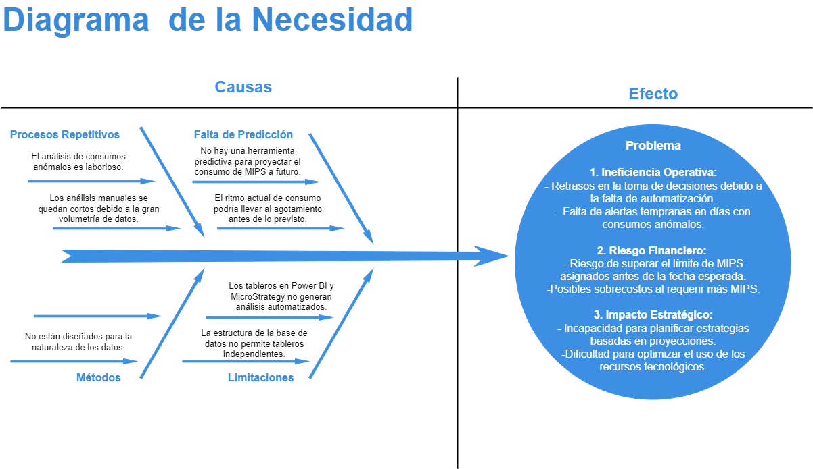
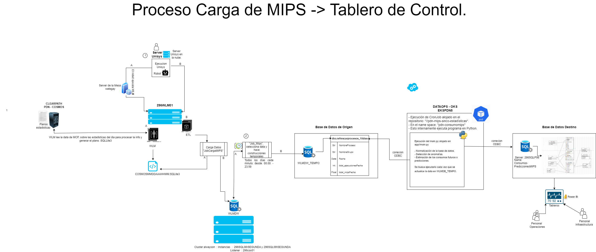

**ESTADÍSTICAS DEL CONSUMO DE MIPS.**

**Área:** DevSecOps.

**Analista Ágil:** Estiben Andrey González Londoño.

**Dominio:** Gestion de MIPS.

**Proyecto:** Detección de Anomalías y Predicciones del Consumo de MIPS.

**Palabras Clave:** MIPS, Anomalías, Atípicos, Novedades, Predicción, PROPHET, Pruebas.

**Infraestructura de despliegue:** OKS.

**Sistemas Origen:** SQL Server; WLMDB_TEMPO.

**Sistemas Destino:** SQL Server; Consumos-PrediccionesMIPS.

**Tipo desarrollo:** Modelo.

**Versión Lenguaje:** Python.

**URL Consumo:**

Tabla de contenido

- [Descripción de la necesidad.](#descripción-de-la-necesidad)
- [Diagrama de la necesidad](#diagrama-de-la-necesidad)
- [Descripción de la Solución.](#descripción-de-la-solución)
- [Arquitectura de la Solución.](#arquitectura-de-la-solución)
- [Estructura del Repositorio con el Desarrollo de la Solución.](#estructura-del-repositorio-con-el-desarrollo-de-la-solución)
- [Descripción de las Carpetas y Archivos](#descripción-de-las-carpetas-y-archivos)
  - [app/](#app)
  - [charts/](#charts)
  - [documentation/](#documentation)
  - [experiment/](#experiment)
  - [pipeline/](#pipeline)
  - [Archivos en el directorio raíz](#archivos-en-el-directorio-raíz)
- [Uso](#uso)
  - [Configuración](#configuración)
  - [Ejecutar el Proyecto](#ejecutar-el-proyecto)

* [Inventario de Artefactos](#inventario-de-artefactos)
* [Topologías](#topologías)
* [Directorios](#directorios)
* [Operaciones de la Interfaz (Servicio)](#Operaciones-de-la-Interfaz-(Servicio))

### Descripción de la necesidad.

En el año 2020, el Grupo Éxito firmó un contrato con Unisys, un proveedor de tecnología, para renovar la plataforma ClearPath, que soporta el sistema SINCO (Sistema de Información Comercial), el CORE comercial de la compañía. Este contrato, con una duración de 84 meses, incluyó una asignación de 284.000 MIPS (Million Instructions Per Second), una métrica que mide el procesamiento de las operaciones que pasan por el ClearPath. Cada unidad de MIPS tiene un costo de \$95 USD, lo que sitúa el valor total del contrato en aproximadamente 26.9 millones de dólares.

Dada la magnitud de esta inversión, es fundamental para la compañía implementar una gestión rigurosa y un monitoreo constante del consumo de MIPS, además de desarrollar estrategias que mejoren la visibilidad de los procesos para prevenir consumos excesivos y lograr ahorros significativos. Según las proyecciones, la cantidad de MIPS habilitados podría agotarse en febrero de 2027, tres años antes de lo deseado.

El equipo de Infraestructura y Operaciones ha desarrollado herramientas analíticas para gestionar este consumo como tableros en Power BI y Microstrategy. Sin embargo, estos tableros tienen limitaciones. Por ejemplo, una de las tareas que surgen diariamente es el conocer qué procesos, de todos los catalogados en la base de datos (9680), tuvieron un consumo anómalo para un día particular; se tiene en especial consideración los días en los que el consumo total de MIPS supera su media de consumo diario (para el 2024 la media del consumo de MIPS es de 97 MIPS, este valor puede variar dependiendo del día de la semana). Por lo anterior, se presenta una primera necesidad de construir una herramienta que permita ejecutar este análisis de forma automática y diaria de tal forma que los tableros tengan el valor añadido de poder listar aquellos procesos con consumos anómalos, agilizando el proceso de análisis y buscando informar a tiempo las novedades a los equipos de Infraestructura y Operaciones para que ellos puedan tomar las medidas adecuadas.

Dado que el contrato con Unisys tiene un número limitado de MIPS para consumir, surgen las siguientes preguntas: teniendo en cuenta el histórico de consumo y el ritmo de consumo actual ¿cuántos MIPS se consumirán en el siguiente mes, en el siguiente semestre, en el siguiente año, ...? ¿La cantidad de MIPS habilitados hoy día es suficiente para suplir la demanda hasta la fecha esperada? En caso negativo, ¿cuál debe ser la media de consumo diario para que los recursos sean suficientes? Por lo anterior, la segunda necesidad es un modelo predictivo que tenga en cuenta las tendencias y patrones del pasado y permita a los equipos ver hacia el futuro para planificar estrategias de negocio efectivas, asegurando que la compañía mantenga un desempeño óptimo en la ejecución de su Sistema de Información Comercial (SINCO) y en el uso eficiente de sus recursos tecnológicos.

| **Nombre de la interfaz:** | ESTADÍSTICAS DEL CONSUMO DE MIPS                                                                                                                                                                                                                                                                                                                                                                                                         |
| -------------------------------- | ----------------------------------------------------------------------------------------------------------------------------------------------------------------------------------------------------------------------------------------------------------------------------------------------------------------------------------------------------------------------------------------------------------------------------------------- |
| **Qué**                   | Necesidad de tener tableros con información más detallada sobre el consumo de MIPS.                                                                                                                                                                                                                                                                                                                                                    |
| **Porqué**                | - Porque los análisis de novedades se hacen de manera manual, lo que consume energía y tiempo<br /> que puede ser invertido en tareas de mayor prioridad sin descuidar el monitoreo del consumo de MIPS. <br />- Porque la simple intuición y las proyecciones usando aritmética son poco fiables a la hora de predecir<br /> los consumos, especialmente si el periodo de tiempo hacía adelante que se quiere predecir es grande. |
| **Para qué**              | - Para que los equipos de Infraestructura y Operaciones tengan acceso a las novedades diarias de forma<br />entendible, simple, concisa y fiable haciendo sus operaciones más agiles.<br />- Asimismo, para que los equipos tenga una idea del comportamiento futuro de los consumos basandose<br />en un modelo de Machine Learning de confianza.                                                                                       |

### Diagrama de la necesidad



### Descripción de la Solución.

El objetivo es desarrollar e implementar dos modelos analíticos que se ejecuten automáticamente en los sistemas productivos del Grupo Éxito y generen reportes diarios. El primer modelo estará enfocado en detectar procesos con consumos de MIPS anómalos, aplicando la metodología del **rango intercuartílico** cuando los consumos, agrupados por proceso y día de la semana, presenten una distribución normal, y la metodología de la **desviación absoluta mediana** en caso contrario. El segundo modelo, por su parte, estará diseñado para predecir el consumo total de MIPS, asegurando que las métricas de error (MAE, MAPE, RMSE y sMAPE) se mantengan por debajo del 10 \%.


### Arquitectura de la Solución.

En el siguiente diagrama de componentes se muestra el diseño de la integración y la relación con los diferentes componentes:



### Estructura del Repositorio con el Desarrollo de la Solución.

```apache

`MIPS-SINCO-ESTADISTICAS/
    ├── app/
    	│ ├── database_tools/ 
        	│ ├── init.py 
        	│ ├── connections.py 
        	│ ├── create_tables.py 
        	│ ├── delete_tables.py 
        	│ └── update_tables.py 
    	│ ├── forecast_tools/ 
        	│ │ ├── init.py 
        	│ │ └── metrics.py
    	│ ├── main_functions/ 
        	│ | ├── init.py
        	│ | ├── forecasting.py
		│ | ├── inserting_data.py 
        	│ | └── novelty_detection.py
    	│ └── main.py

    ├── charts/
    	│ ├── templates/ 
        	│ │ ├── cronjob.yaml
        	│ │ └── secrets.yaml
    	│ ├── Chart.yaml
	│ └── values.yaml

    ├── documentation/
    	│ ├── Arquitecura_Solucion.drawio.png 
	│ ├── Diagrama_Necesidad.drawio.png
    	│ ├── readme.md
	│ └── Tablas_BD_Destino.drawio.png

    ├── experiment/
    	│ ├── data/ 
        	│ ├── input/ 
        	│ └── output/
    	│ ├── notebooks/ 
        	│ │ └── exploratory_analysis.ipynb

    ├── pipeline/
    	│ ├── main-pipeline.yml
	│ └── vars_azure_pipeline.yml

    ├── .dockerignore
    ├── .gitignore
    ├── catalog-info-yaml
    ├── docker-compose.yaml
    ├── Dockerfile
    ├── mkdocs.yml
    └── requirements.txt 

```

### Descripción de las Carpetas y Archivos

#### app/

* **database_tools/**
  * **init.py** : Inicializa el módulo de herramientas de base de datos.
  * **connections.py** : Gestiona las conexiones a la base de datos.
  * **create_tables.py** : Contiene funciones para crear tablas en la base de datos.
  * **delete_tables.py** : Contiene funciones para eliminar tablas en la base de datos.
  * **update_tables.py** : Contiene funciones para actualizar tablas en la base de datos.
* **forecast_tools/**
  * **init.py** : Inicializa el módulo de herramientas de pronóstico.
  * **metrics.py** : Contiene funciones para calcular varias métricas de precisión del pronóstico.
* **main_functions/**
  * **init.py** : Inicializa el módulo de funciones principales.
  * **forecasting.py** : Contiene funciones para el pronóstico de datos.
  * **inserting_data.py** : Contiene funciones para insertar datos en la base de datos.
  * **novelty_detection.py** : Contiene funciones para detectar patrones novedosos en los datos.
* **main.py** : El punto de entrada principal de la aplicación.

#### charts/

* **templates/**
  * **cronjob.yaml** : Configuración para un trabajo cron.
  * **secrets.yaml** : Configuración para la gestión de secretos.
* **Chart.yaml** : Archivo de configuración del gráfico de Helm.
* **values.yaml** : Valores predeterminados para el gráfico de Helm.

#### documentation/

* **Arquitecura_Solucion.drawio.png** : Diagrama de la arquitectura de la solución.
* **Diagrama_Necesidad.drawio.png** : Diagrama de los requisitos.
* **readme.md** : Documentación e instrucciones para el proyecto.
* **Tablas_BD_Destino.drawio.png** : Diagrama de las tablas de la base de datos de destino.

#### experiment/

* **data/**
  * **input/** : Directorio para datos de entrada.
  * **output/** : Directorio para datos de salida.
* **notebooks/**
  * **exploratory_analysis.ipynb** : Cuaderno Jupyter para el análisis exploratorio de datos.

#### pipeline/

* **main-pipeline.yml** : Archivo de configuración del pipeline principal.
* **vars_azure_pipeline.yml** : Variables para el pipeline de Azure.

#### Archivos en el directorio raíz

* **.dockerignore** : Especifica archivos y directorios a ignorar en las construcciones de Docker.
* **.gitignore** : Especifica archivos y directorios a ignorar en Git.
* **catalog-info.yaml** : Archivo de información del catálogo.
* **docker-compose.yaml** : Archivo de configuración de Docker Compose.
* **Dockerfile** : Instrucciones para construir una imagen de Docker.
* **mkdocs.yml** : Archivo de configuración para la documentación con MkDocs.
* **requirements.txt** : Lista de dependencias de Python para el proyecto.

### Uso

#### Configuración

1. Clona el repositorio.
2. Crea un entorno virtual y actívalo.
3. Instala las dependencias:

   ```powershell
   pip install -r requirements.txt
   ```
4. Configura las variables de entorno en un archivo .env.

#### Ejecutar el Proyecto

Para ejecutar el proyecto, ejecuta el archivo main.py:

```powershell
   python3 main.py
```
